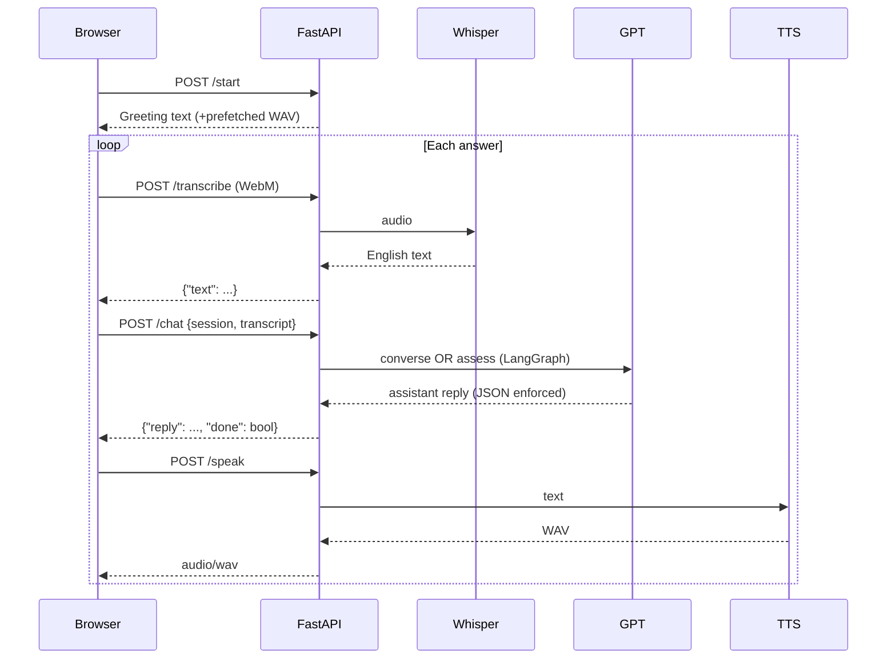

# AI‑Tutor – Project README

## Table of Contents
1. [Project Overview](#project-overview)  
2. [Features](#features)  
3. [Tech Stack](#tech-stack)  
4. [Folder Structure](#folder-structure)  
5. [Quick Start](#quick-start)  
6. [Detailed Setup](#detailed-setup)  
7. [Environment Variables](#environment-variables)  
8. [How It Works](#how-it-works)  
9. [Troubleshooting](#troubleshooting)  
10. [Road‑map & Ideas](#road-map--ideas)  

---

## Project Overview
**AI‑Tutor** is a voice‑first demo that:

* greets the learner,  
* asks three adaptive questions,  
* determines their CEFR English level (A1 → C2),  
* responds out loud,  
* and shows the conversation in a modern “glass‑card” UI.

The back‑end is a **FastAPI** micro‑service that stitches together:

* **OpenAI Whisper** (speech‑to‑text, locked to English)  
* **GPT‑4o‑mini → GPT‑3.5‑turbo fallback** (dialogue + assessment)  
* **OpenAI Text‑to‑Speech (tts‑1)**  
* **LangGraph** to manage the conversation state

The front‑end is **static HTML + CSS + vanilla JS**—no build step required.

---

## Features
| Category | Details |
|---|---|
| Voice pipeline | Browser mic ➜ WebM/Opus ➜ Whisper‑1 (EN) ➜ GPT ➜ TTS (WAV) |
| Conversation logic | LangGraph state‑machine (greeting → 3 Qs → assess) |
| Assessment | CEFR level returned as JSON; model forced to output valid JSON |
| UI | Frosted‑glass card, gradient bubbles, mic button, live avatar glow |
| Autoplay workaround | Pre‑fetch greeting TTS, play after first gesture |
| Noise filtering | Ignores answers with < 3 Latin letters |
| Language lock | `language="en"` prevents Persian / other scripts |

---

## Tech Stack
| Layer | Technology / Library |
|---|---|
| Back‑end | Python 3.11, **FastAPI**, **LangGraph**, **openai** SDK |
| Speech to Text | **OpenAI Whisper v1** |
| LLM | **GPT‑4o‑mini** (primary) → **GPT‑3.5‑turbo‑0125** (fallback) |
| Text to Speech | **OpenAI tts‑1** (Alloy voice) |
| Front‑end | Plain HTML + CSS + JavaScript (ES modules), no framework |
| Styling | Glassmorphism / neumorphism, pure CSS |
| Deployment | Any machine with Python >=3.10 + a static file server |

---

## Folder Structure
```
ai‑tutor/
│
├── backend/
│   ├── server.py          # FastAPI service (main entry)
│   └── requirements.txt   # Python deps
│
└── frontend/
    ├── index.html         # single‑page UI
    ├── style.css          # glassmorphic styling
    ├── script.js          # mic, chat, TTS logic
    └── avatar.png         # circular avatar image
```

---

## Quick Start (local)

```bash
# 1. clone / unpack the repo
cd ai-tutor

# 2. --- back‑end ------------------------------------------------------
python -m venv .venv && source .venv/bin/activate  # Windows: .venv\Scripts\activate
pip install -r backend/requirements.txt
cp backend/.env.example backend/.env               # create file & add your key
uvicorn backend.server:app --reload --port 8000

# 3. --- front‑end -----------------------------------------------------
# in a second terminal
npx serve frontend   # or python -m http.server 4000, live-server, etc.
# open http://localhost:3000 or the port serve prints
```

> **Tip** If you have `python -m http.server`, run it inside `frontend/` for a zero‑install static server.

---

## Detailed Setup

### 1 · Prerequisites
* Python 3.10+  
* Node (via npm) **optional** – only for `npx serve` convenience  
* An **OpenAI API key** with Whisper, Chat, and TTS access (free or paid)

### 2 · Install Python dependencies
```bash
cd backend
pip install -r requirements.txt
```

### 3 · Create `.env`
```ini
# backend/.env
OPENAI_API_KEY=sk-********************************
```

### 4 · Run FastAPI
```bash
uvicorn server:app --reload --port 8000
```
The server will be reachable at `http://localhost:8000`.

### 5 · Serve static files
Any static server works; examples:
```bash
# quickest (requires Node):
npx serve frontend

# Python built‑in (no Node):
cd frontend
python -m http.server 3000
```

Open the printed URL in Chrome/Edge/Firefox with microphone permission.

---

## Environment Variables

| Variable | Required | Purpose |
|---|---|---|
| `OPENAI_API_KEY` | **Yes** | Authenticates all Whisper / Chat / TTS calls |

Place it in `backend/.env` or export it in your shell.

---

## How It Works (backend)



---

## Troubleshooting

| Symptom | Fix |
|---|---|
| **Persian / other script output** | Whisper is locked to `language="en"`. Verify you run this server version and you actually speak English. |
| **`JSONDecodeError`** | Server now enforces JSON mode; if error persists, check that your account has access to GPT‑3.5‑turbo‑0125 or higher. |
| **Mic permission denied** | Refresh page and allow “microphone” in browser prompt; on iOS you need Safari 16+ with HTTPS. |
| **Audio doesn’t play first time** | A click anywhere on the page unlocks autoplay; ensure you see the greeting bubble first. |

---

## Road‑map & Ideas

* True phoneme‑based lip‑sync with viseme mesh  
* Persistent learner profiles & progress charts  
* Admin dashboard (lesson uploads, rubric tuning)  
* Multi‑lingual mode (`language=auto` plus language switcher UX)  
* JWT auth & database (PostgreSQL) for production  
* Docker `docker‑compose.yml` for one‑command deployment  

Pull requests & suggestions are welcome—happy teaching!